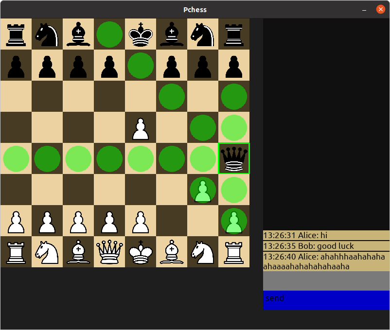

# Pchess
Chess multiplayer game client and server python implementation
## Table of contents
* [General info](#general-info)
* [Technologies](#technologies)
* [Setup](#setup)

## General info
The project contains server that handle multiple client connections and desktop client application made with pygame framework. Communication between client and server is done via standard python sockets
## Technologies
Project is created with:
* Python 3.8
* pygame 2.0.0
## Setup
To run server use:
```
$ git clone "https://github.com/maciejp12/pchess.git"
$ cd pchess/server
$ python3 runserver.py
```
Check pygame version before starting client (should be 2.0.0):
```
$ python3 -m pip list | grep pygame
pygame                  2.0.0 
```
If pygame is not installed install it with:
```
$ python3 -m pip install pygame
```
To start client application:
```
$ cd ../client
$ python3 runclient.py
```

After starting client and server running in the background, server will wait for one more client connection to start a game. Default server socket bind address is localhost and default port is 6667.

Game starts after both clients enter name in the name text input and click submit button. Clients can perform game moves on their turns and send text messages in simple chat on the right side of client application.




